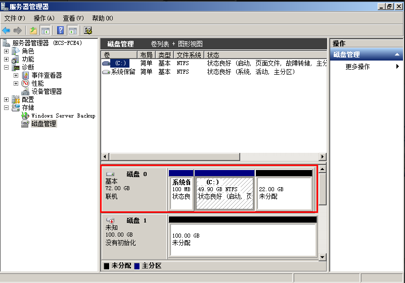
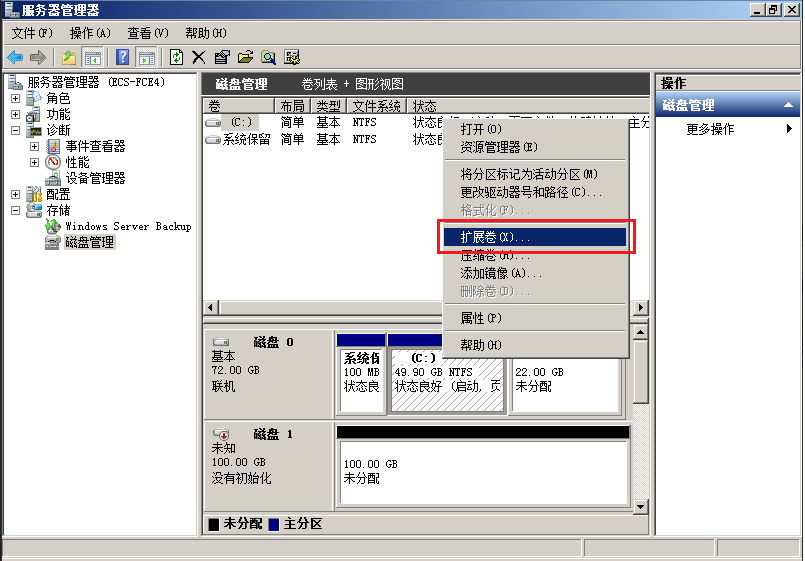
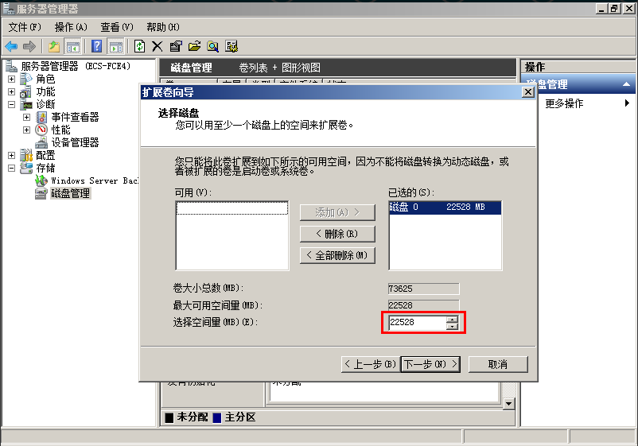
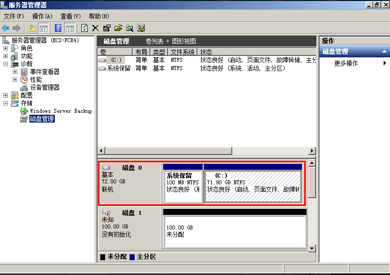

# Windows云硬盘扩容后处理

## 操作场景

扩容成功后，需要将扩容部分的容量划分至原有分区内，或者对扩容部分的云硬盘分配新的分区。

本文以“Windows Server 2008 R2 Enterprise”操作系统为例。

不同操作系统的操作可能不同，本文仅供参考，具体操作步骤和差异请参考对应操作系统的产品文档。

> **注意：**   
>扩容时请谨慎操作，误操作可能会导致数据丢失或者异常，建议扩容前对数据进行备份，可以使用VBS或者快照功能，VBS请参见[管理备份云硬盘](管理备份云硬盘.md)，快照功能请参见[创建快照](创建快照.md)。  

## 前提条件

-   已登录云服务器。
    -   弹性云服务器请参见《弹性云服务器用户指南》。
    -   裸金属服务器请参见《裸金属服务器用户指南》。

-   已挂载云硬盘至云服务器，且该云硬盘的扩容部分未分配分区。

## 系统盘

1.  在云服务器桌面，选择“开始”，右键单击后在菜单列表中选择“计算机”，选择“管理”。

    弹出“服务器管理”窗口。

2.  在左侧导航树中，选择“存储 \> 磁盘管理”。

    进入“磁盘管理”页面，如[图1](#fig1686908719287)所示。

    **图 1**  磁盘管理（系统盘）  
    

3.  在“磁盘管理”界面，选择需要分配分区的磁盘，磁盘显示扩容前的容量大小。
4.  在所选磁盘上右击，选择“扩展卷”，如[图2](#fig585833019287)所示。

    **图 2**  选择扩展卷  
    

5.  在弹出的“扩展卷向导”界面中选择“下一步”，如[图3](#fig4944876519287)所示。

    **图 3**  扩展卷向导  
    

6.  在弹出的“扩展卷向导”界面中的“选择空间量（MB）（E）：”行中输入需要扩容的磁盘容量，单击“下一步”，如[图4](#fig6057097319287)所示。

    **图 4**  选择空间量  
    

7.  单击“完成”完成向导。

    扩容成功后显示磁盘的容量将大于扩容前磁盘的容量，如[图5](#fig2139119119287)所示。

    **图 5**  扩容成功  
    

## 数据盘

1.  在云服务器桌面，选择“开始”，右键单击后在菜单列表中选择“计算机”，选择“管理”。

    弹出“服务器管理”窗口。

2.  在左侧导航树中，选择“存储 \> 磁盘管理”。

    进入“磁盘管理”页面，如[图6](#fig129789723114)所示。

    **图 6**  磁盘管理（数据盘）  
    

3.  在“磁盘管理”界面，选择需要分配分区的磁盘，磁盘显示扩容前的容量大小。
4.  在所选磁盘上右击，选择“扩展卷”，如[图7](#fig6892073193332)所示。

    **图 7**  选择扩展卷\(Windows 2008\)  
    .png "选择扩展卷(Windows-2008)")

5.  在弹出的“扩展卷向导”界面中选择“下一步”，如[图8](#fig21912605193332)所示。

    **图 8**  扩展卷向导\(Windows 2008\)  
    .png "扩展卷向导(Windows-2008)")

6.  在弹出的“扩展卷向导”界面中的“选择空间量（MB）（E）：”行中输入需要扩容的磁盘容量，单击“下一步”，如[图9](#fig58557281193332)所示。

    **图 9**  选择空间量\(Windows 2008\)  
    .png "选择空间量(Windows-2008)")

7.  单击“完成”完成向导。

    扩容成功后显示磁盘的容量将大于扩容前磁盘的容量，如[图10](#fig31824203193332)所示。

    **图 10**  扩容成功\(Windows 2008\)  
    .png "扩容成功(Windows-2008)")

