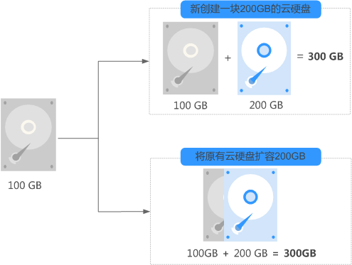
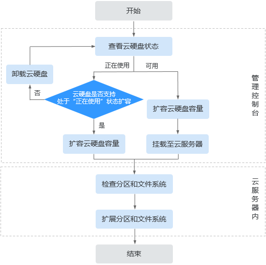

# 云硬盘扩容概述

## 什么是云硬盘扩容？

当您的云硬盘存储容量不足时，您可以通过以下方式增加单台云服务器的存储容量：

-   创建一块新的云硬盘，并作为数据盘挂载给云服务器，完成后需要自行初始化后使用。
-   [扩容已有云硬盘](#section173511542246)，容量扩大后需要自行扩展分区和文件系统。系统盘和数据盘均支持扩容。

    当前EVS只支持扩大容量，不支持缩小容量。

    **图 1**  新创建和扩容云硬盘  
    

## 怎样扩容已有云硬盘？

云硬盘扩容操作分为两部分，首先在管理控制台扩容云硬盘的存储容量，然后登录云服务器扩展分区和文件系统，此后云硬盘才可以使用。

**图 2**  云硬盘扩容流程  

1.  登录管理控制台，扩容云硬盘的容量。需要根据云硬盘状态选择对应的扩容方法。查看云硬盘状态的方法请参见[查看云硬盘状态](查看云硬盘状态.md)。
    -   若云硬盘状态为“正在使用”，表示云硬盘已挂载给云服务器，需要判断云硬盘是否支持处于“正在使用”状态下扩容，扩容条件请参见[约束与限制](扩容-正在使用-状态的云硬盘容量.md#section158147122515)。
        -   若支持，请参见[扩容“正在使用”状态的云硬盘容量](扩容-正在使用-状态的云硬盘容量.md)，扩容云硬盘容量。
        -   若不支持，请参见[扩容“可用”状态的云硬盘容量](扩容-可用-状态的云硬盘容量.md)，先卸载云硬盘后，再扩容云硬盘容量。

    -   若云硬盘状态为“可用”，表示云硬盘未挂载至任何云服务器，可以直接开始扩容，扩容请参见[扩容“可用”状态的云硬盘容量](扩容-可用-状态的云硬盘容量.md)。

2.  通过管理控制台扩容成功后，仅扩大了云硬盘的存储容量，还需要登录云服务器自行扩展分区和文件系统。

    -   Windows：[扩展磁盘分区和文件系统（Windows）](扩展磁盘分区和文件系统（Windows）.md)
    -   Linux：[分区和文件系统扩展前准备（Linux）](分区和文件系统扩展前准备（Linux）.md)

    如果在云服务器关机的时候扩容了磁盘，则开机后，Windows系统盘、Windows数据盘、Linux系统盘的新增容量可能会自动扩展至末尾分区内，此时新增容量可以直接使用。

    > **须知：**   
    >当磁盘已经投入使用后，请在扩容前务必检查磁盘的分区形式。具体说明如下：  
    >-   当磁盘使用MBR分区形式时，容量最大支持2 TB（2048 GB），超过2 TB的部分无法使用。  
    >-   当磁盘使用GPT分区形式时，容量最大支持18 EB（19327352832 GB）。EVS服务支持的最大数据盘容量为32 TB（32768 GB），即您最大可将数据盘扩容至32 TB。  
    >如果当前磁盘使用的是MBR分区形式，并且因为业务需求要将该磁盘扩容至2 TB以上并投入使用。则必须将磁盘分区形式由MBR切换成GPT，期间会中断业务，并且更换磁盘分区形式时会清除磁盘的原有数据，请在扩容前先对数据进行备份。  

## 相关操作

云硬盘扩容常见问题请参见[云硬盘扩容问题](https://support.huaweicloud.com/evs_faq/evs_01_0077.html)。

