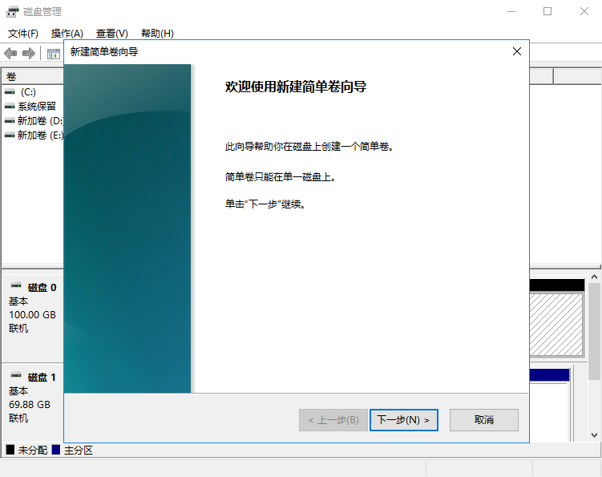
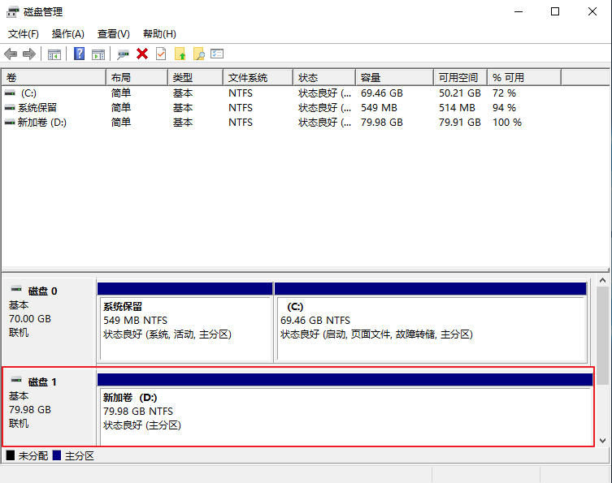

# 扩展磁盘分区和文件系统（Windows 2016）

## 操作场景

通过云服务管理控制台扩容成功后，仅扩大了云硬盘的存储容量，因此需要参考本章节操作扩展分区和文件系统。

对于Windows操作系统而言，需要登录云服务器将扩容部分的容量划分至已有的分区中，或者为扩容部分的容量分配新的分区。

如果在云服务器关机的时候扩容了磁盘，则开机后，Windows系统盘、Windows数据盘的新增容量可能会自动扩展至末尾分区内，此时新增容量可以直接使用。

本文以“Windows Server 2016 Standard 64bit”操作系统为例。提供以下扩容方法：

-   系统盘：
    -   已有C盘的情况下，将扩容部分的容量增加到C盘中，用作系统盘。请参见[系统盘（将扩容部分的容量增加到C盘）](#section026022982311)。
    -   已有C盘的情况下，为扩容部分的容量新创建一块F盘，用作数据盘。请参见[系统盘（将扩容部分的容量新增到F盘）](#section19471943163216)。

-   数据盘：
    -   已有D盘的情况下，将扩容部分的容量增加到D盘中，用作数据盘。请参见[数据盘（将扩容部分的容量增加到D盘）](#section17259018135819)。
    -   已有D盘的情况下，为扩容部分的容量新创建一块E盘，用作数据盘。请参见[数据盘（将扩容部分的容量新增到E盘）](#section1983618124920)。

不同操作系统的操作可能不同，本文仅供参考，具体操作步骤和差异请参考对应操作系统的产品文档。

> **须知：** 
>扩容时请谨慎操作，误操作可能会导致数据丢失或者异常，建议扩容前对数据进行备份，可以使用CBR或者快照功能，CBR请参见[管理备份云硬盘](管理备份云硬盘.md)，快照功能请参见[创建快照（公测）](创建快照（公测）.md)。

## 前提条件

-   已通过管理控制台扩容云硬盘容量，并已挂载至云服务器，请参见[扩容“正在使用”状态的云硬盘容量](扩容-正在使用-状态的云硬盘容量.md)或者[扩容“可用”状态的云硬盘容量](扩容-可用-状态的云硬盘容量.md)。
-   已登录云服务器。
    -   弹性云服务器请参见[登录弹性云服务器](https://support.huaweicloud.com/qs-ecs/zh-cn_topic_0092494193.html)。
    -   裸金属服务器请参见[登录裸金属服务器](https://support.huaweicloud.com/qs-bms/bms_qs_0004.html)。

## 系统盘（将扩容部分的容量增加到C盘）

系统盘原有容量为40GB，通过管理控制台将系统盘扩容30GB后，登录云服务器将30GB新增容量增加到C盘中。操作完成后，C盘有70GB的空间可用作系统盘。

1.  在云服务器桌面，右键单击左下方开始图标，选择“磁盘管理”。

    进入“磁盘管理”页面，如[图1](#fig1686908719287)所示。

    **图 1**  磁盘管理\(Windows 2016\)  
    .png "磁盘管理(Windows-2016)")

    > **说明：** 
    >若此时无法看到扩容部分的容量，请选中“磁盘管理”，右键单击“刷新”后即可。

2.  在“磁盘管理”界面，选择需要扩大分区的磁盘，磁盘显示扩容前的容量大小。
3.  在所选磁盘上右键单击，选择“扩展卷”，如[图2](#fig585833019287)所示。

    **图 2**  选择扩展卷（Windows 2016）  
    

4.  在弹出的“扩展卷向导”界面中选择“下一步”，如[图3](#fig4944876519287)所示。

    **图 3**  扩展卷向导（Windows 2016）  
    

5.  在弹出的“扩展卷向导”界面中的“选择空间量\(MB\)\(E\)：”行中输入需要扩容的磁盘容量，单击“下一步”，如[图4](#fig6057097319287)所示。

    **图 4**  选择空间量（Windows 2016）  
    

6.  单击“完成”，关闭向导。

    扩容成功后显示磁盘的容量将大于扩容前磁盘的容量，如[图5](#fig2139119119287)所示。

    **图 5**  扩容成功（Windows 2016）  
    

## 系统盘（将扩容部分的容量新增到F盘）

系统盘原有容量为40GB，通过管理控制台将系统盘扩容60GB后，登录云服务器为60GB新增容量新创建一块F盘。操作完成后，新增60GB的F盘可用作数据盘。

1.  在云服务器桌面，右键单击左下方开始图标，选择“磁盘管理”。

    进入“磁盘管理”页面，如[图6](#fig1875632841)所示。

    **图 6**  未分配（Windows 2016 系统盘）  
    

    > **说明：** 
    >若此时无法看到扩容部分的容量，请选中“磁盘管理”，右键单击“刷新”后即可。

2.  在磁盘0的“未分配区域”右键单击，选择“新建简单卷”，如[图7](#fig376153211419)所示。

    **图 7**  新建简单卷（Windows 2016 系统盘）  
    

3.  在弹出的“新建简单卷向导”界面中选择“下一步”，如[图8](#fig57610321448)所示。

    **图 8**  新建简单卷向导（Windows 2016 系统盘）  
    

4.  在弹出的“指定卷大小”界面中，指定“简单卷大小”行中输入需要扩容的磁盘容量，此处以默认为例，单击“下一步”，如[图9](#fig157611321419)所示。

    **图 9**  指定卷大小（Windows 2016 系统盘）  
    

5.  在弹出的“分配驱动器号和路径”界面中，指定“分配驱动器号”行中选择驱动器号，此处以“F”为例，单击“下一步”，如[图10](#fig1576332646)所示。

    **图 10**  分配驱动器号和路径（Windows 2016 系统盘）  
    

6.  勾选“按下列设置格式化这个卷”，并根据实际情况设置参数，格式化新分区，单击“下一步”完成分区创建，如[图11](#fig3771732147)所示。

    **图 11**  格式化分区（Windows 2016 系统盘）  
    

7.  单击“完成”完成向导。

    扩容成功后可以看到新加卷（F:），如[图12](#fig207719321442)所示。

    **图 12**  新加卷F（Windows 2016）  
    

## 数据盘（将扩容部分的容量增加到D盘）

数据盘原有容量为30GB，通过管理控制台将数据盘扩容50GB后，登录云服务器将50GB新增容量增加到D盘中。操作完成后，D盘有80GB的空间可用作数据盘。

1.  在云服务器桌面，右键单击左下方开始图标，选择“磁盘管理”。

    进入“磁盘管理”页面，如[图13](#fig129789723114)所示。

    **图 13**  磁盘管理（Windows 2016 数据盘）  
    

    > **说明：** 
    >若此时无法看到扩容部分的容量，请选中“磁盘管理”，右键单击“刷新”后即可。

2.  在“磁盘管理”界面，选择需要分配分区的磁盘，磁盘显示扩容前的容量大小。
3.  在所选磁盘上右键单击，选择“扩展卷”，如[图14](#fig6892073193332)所示。

    **图 14**  选择扩展卷（Windows 2016系统）  
    

4.  在弹出的“扩展卷向导”界面中选择“下一步”，如[图15](#fig21912605193332)所示。

    **图 15**  扩展卷向导（Windows 2016系统）  
    

5.  在弹出的“扩展卷向导”界面中的“选择空间量\(MB\)\(E\)：”行中输入需要扩容的磁盘容量，单击“下一步”，如[图16](#fig58557281193332)所示。

    **图 16**  选择空间量（Windows 2016系统）  
    

6.  单击“完成”完成向导。

    扩容成功后显示磁盘的容量将大于扩容前磁盘的容量，如[图17](#fig31824203193332)所示。

    **图 17**  扩容成功（Windows 2016系统）  
    

## 数据盘（将扩容部分的容量新增到E盘）

数据盘原有容量为80GB，通过管理控制台将数据盘扩容50GB后，登录云服务器为50GB新增容量新创建一块E盘。操作完成后，新增50GB的E盘可用作数据盘。

1.  在云服务器桌面，右键单击左下方开始图标，选择“磁盘管理”。

    进入“磁盘管理”页面，如[图18](#fig1850964851716)所示。

    **图 18**  未分配（Windows 2016 数据盘）  
    

    > **说明：** 
    >若此时无法看到扩容部分的容量，请选中“磁盘管理”，右键单击“刷新”后即可。

2.  在磁盘1的“未分配区域”右键单击，选择“新建简单卷”，如[图19](#fig650934818179)所示。

    **图 19**  新建简单卷（Windows 2016 数据盘）  
    

3.  在弹出的“新建简单卷向导”界面中选择“下一步”，如[图20](#fig4509194818179)所示。

    **图 20**  新建简单卷向导（Windows 2016 数据盘）  
    

4.  在弹出的“指定卷大小”界面中，指定“简单卷大小”行中输入需要扩容的磁盘容量，此处以默认为例，单击“下一步”，如[图21](#fig14509114811173)所示。

    **图 21**  指定卷大小（Windows 2016 数据盘）  
    

5.  在弹出的“分配驱动器号和路径”界面中，指定“分配驱动器号”行中选择驱动器号，此处以“E”为例，单击“下一步”，如[图22](#fig2050063074520)所示。

    **图 22**  分配驱动器号和路径（Windows 2016 数据盘）  
    

6.  勾选“按下列设置格式化这个卷”，并根据实际情况设置参数，格式化新分区，单击“下一步”完成分区创建，如[图23](#fig19840335173018)所示。

    **图 23**  格式化分区（Windows 2016 数据盘）  
    

7.  单击“完成”完成向导。

    扩容成功后可以看到新加卷（E:），如[图25](#fig55105489173)所示。

    **图 24**  完成  
    

    **图 25**  新加卷E  
    

