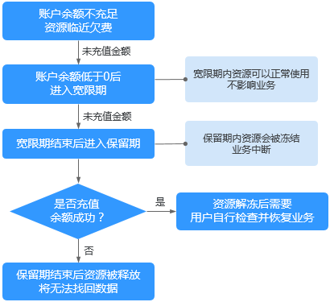

# 按需计费磁盘欠费前后的影响及使用建议

## 按需计费资源的宽限期、保留期介绍

“按需计费”计费模式属于后付费，即会根据使用资源的时间从您的帐户余额中扣费，例如购买按需计费的磁盘。

若在帐户余额低于0后，您未充值帐户余额，则此时不会直接释放您的资源，而是会进入宽限期。

宽限期到期前，若您仍未充值帐户余额，则宽限期结束后资源会被冻结，并且进入保留期。

保留期到期前，若您充值帐户余额，则资源会被解冻。

保留期到期前，若您未充值帐户余额，则保留期结束后资源会被释放。

> **说明：**   
>宽限期和保留期的时长会根据客户的等级有所不同，若您需要了解宽限期和保留期的更多信息，请参见“[宽限期保留期用户指南](https://support.huaweicloud.com/usermanual-period/zh-cn_topic_0086671074.html)”。  

**图 1**  按需计费资源欠费前后的影响  

## 冻结、解冻、释放资源时对业务的影响

-   资源冻结时：资源将被限制访问和使用，会导致您的业务中断。例如云服务器被冻结时，会自动关机。例如磁盘被冻结时，磁盘IO会被限制。
-   资源解冻时：资源将被解除限制，但是需要您自行检查并恢复业务。例如云服务器解冻后，需要您自行开机。
-   资源释放时：资源将被释放，存储在资源中的数据将被删除，数据无法找回。

## 按需计费资源的使用建议

如果您无需继续使用按需计费磁盘，则可以通过管理控制台卸载并删除磁盘。删除磁盘的方法请参见“云硬盘用户指南 \> 删除云硬盘”。

对于以下常见的按需计费磁盘的使用场景，您可以参考我们提供的建议开通帐户余额预警、按需转包周期等功能，并关注帐户余额预警、资源冻结等相关通知信息，以便及时了解资源情况，确保您的业务和数据不受影响。

**表 1**  常见使用场景建议

<table><thead align="left"><tr id="zh-cn_topic_0123376077_zh-cn_topic_0123153889_row11576205111298"><th class="cellrowborder" valign="top" width="32%" id="mcps1.2.3.1.1">
常见使用场景

</th>
<th class="cellrowborder" valign="top" width="68%" id="mcps1.2.3.1.2">
使用建议

</th>
</tr>
</thead>
<tbody><tr id="row89501543132713"><td class="cellrowborder" valign="top" width="32%" headers="mcps1.2.3.1.1 ">
按需计费资源

</td>
<td class="cellrowborder" valign="top" width="68%" headers="mcps1.2.3.1.2 "><ul id="zh-cn_topic_0123376077_zh-cn_topic_0123153889_ul898784410339"><li>及时充值，确保帐户余额充足</li><li>开通帐户余额预警功能
开通帐户余额预警功能的方法请参见<a href="https://support.huaweicloud.com/billing_faq/zh-cn_topic_000080.html" target="_blank" rel="noopener noreferrer">如何开通余额预警功能</a>

</li><li>关注帐户余额低于预警阈值的通知，及时充值</li><li>关注帐户欠费的通知，及时充值</li></ul>
</td>
</tr>
<tr id="row4952743112719"><td class="cellrowborder" valign="top" width="32%" headers="mcps1.2.3.1.1 ">
包年/包月云服务器挂载按需计费磁盘

</td>
<td class="cellrowborder" valign="top" width="68%" headers="mcps1.2.3.1.2 "><ul id="zh-cn_topic_0123376077_zh-cn_topic_0123153889_ul1435154111588"><li>将磁盘的计费模式由按需计费转为包年/包月
按需变更为包周期的方法请参见<a href="https://support.huaweicloud.com/usermanual-billing/zh-cn_topic_0072297121.html" target="_blank" rel="noopener noreferrer">按需变更为包周期</a>

</li><li>请参考场景“包年/包月资源”的建议</li><li>若未按需转包周期，请参考场景“按需计费资源”的建议</li></ul>
</td>
</tr>
<tr id="row095394392716"><td class="cellrowborder" valign="top" width="32%" headers="mcps1.2.3.1.1 ">
按需计费云服务器挂载包年/包月磁盘

</td>
<td class="cellrowborder" valign="top" width="68%" headers="mcps1.2.3.1.2 "><ul id="zh-cn_topic_0123376077_zh-cn_topic_0123153889_ul179761412313"><li>将云服务器的计费模式由按需计费转为包年/包月
按需变更为包周期的方法请参见<a href="https://support.huaweicloud.com/usermanual-billing/zh-cn_topic_0072297121.html" target="_blank" rel="noopener noreferrer">按需变更为包周期</a>

</li><li>请参考场景“包年/包月资源”的建议</li><li>若未按需转包周期，请参考场景“按需计费资源”的建议</li></ul>
</td>
</tr>
<tr id="zh-cn_topic_0123376077_zh-cn_topic_0123153889_row1283385814378"><td class="cellrowborder" valign="top" width="32%" headers="mcps1.2.3.1.1 ">
包年/包月资源

</td>
<td class="cellrowborder" valign="top" width="68%" headers="mcps1.2.3.1.2 "><ul id="zh-cn_topic_0123376077_zh-cn_topic_0123153889_ul159808174016"><li>及时手动续费
手动续费的方法请参见<a href="https://support.huaweicloud.com/usermanual-billing/zh-cn_topic_0072297179.html" target="_blank" rel="noopener noreferrer">如何手动续费</a>

</li><li>开通自动续费，并确保帐户余额充足
开通自动续费的方法请参见<a href="https://support.huaweicloud.com/usermanual-billing/zh-cn_topic_0072297194.html" target="_blank" rel="noopener noreferrer">如何自动续费</a>

</li><li>关注自动续费失败的通知，及时为帐户充值</li><li>关注资源即将到期的通知，及时续费</li><li>关注资源即将冻结的通知，及时续费</li><li>关注资源即将释放的通知，及时续费</li></ul>
</td>
</tr>
<tr id="zh-cn_topic_0123376077_zh-cn_topic_0123153889_row2057310246448"><td class="cellrowborder" valign="top" width="32%" headers="mcps1.2.3.1.1 ">
包年/包月云服务器挂载包年/包月磁盘

云服务器的到期时间与磁盘不同

</td>
<td class="cellrowborder" valign="top" width="68%" headers="mcps1.2.3.1.2 "><ul id="zh-cn_topic_0123376077_zh-cn_topic_0123153889_ul117091887527"><li>设置统一到期日，到期前或者宽限期内对包年/包月云服务器、以及磁盘批量续费，并选择统一到期日
设置统一到期日的方法请参见<a href="https://support.huaweicloud.com/usermanual-billing/zh-cn_topic_0072297282.html" target="_blank" rel="noopener noreferrer">如何设置统一到期日</a>

批量续费的方法请参见<a href="https://support.huaweicloud.com/usermanual-billing/zh-cn_topic_0072297179.html" target="_blank" rel="noopener noreferrer">如何手动续费</a>

</li><li>请参考场景“包年/包月资源”的建议</li></ul>
</td>
</tr>
</tbody>
</table>

