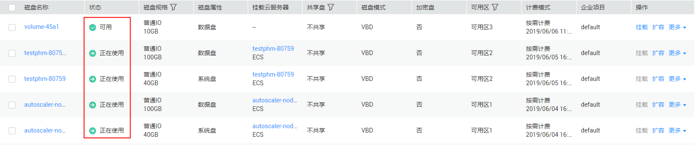
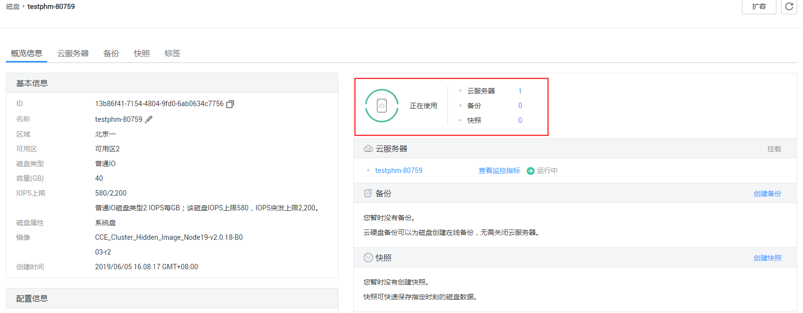

# 查看云硬盘状态

## 操作场景

本章节指导用户查看云硬盘的状态。云硬盘状态的详细说明请参见[云硬盘状态](云硬盘状态.md)。

## 操作步骤

1.  登录管理控制台。
2.  您可以通过以下方法查看云硬盘状态。
    -   通过云硬盘管理控制台查看。
        1.  选择“存储 \> 云硬盘”。

            进入“云硬盘“页面。

        2.  在云硬盘列表下，根据名称找到对应的云硬盘，查看“状态”栏。

            **图 1**  云硬盘列表  
            

    -   从云服务器控制台查看。
        1.  选择“计算 \> 弹性云服务器”。

            进入“弹性云服务器“页面。

        2.  在云服务器列表下，根据名称找到对应的云服务器，单击名称。

            进入云服务器详情页。

        3.  在“云硬盘”页签下，单击待查看的云硬盘所在行的，展开详细信息，并单击云硬盘“ID”。

            进入云硬盘详情页，即可看到云硬盘的状态。

            **图 2**  云硬盘详情页  
            

