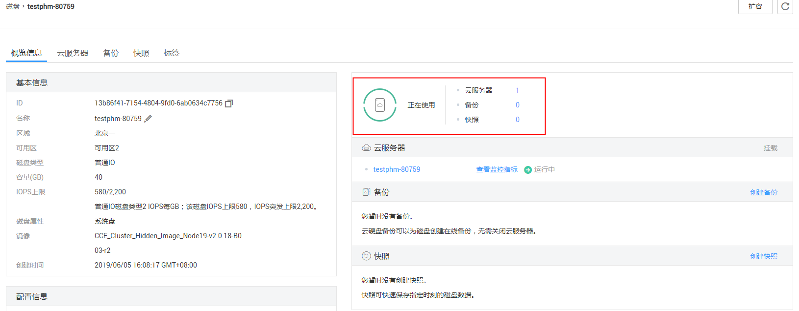

# 查看云硬盘详细信息

## 操作场景

本章节指导用户查看云硬盘详细信息，例如状态、磁盘规格等。方法如下：

-   [通过云硬盘管理控制台查看](#section242672414158)
-   [通过云服务器控制台查看](#section1558615712151)

云硬盘各种状态的详细含义请参见[云硬盘状态](云硬盘状态.md)。

## 通过云硬盘管理控制台查看

1.  登录管理控制台。
2.  选择“存储 \> 云硬盘”。

    进入“云硬盘“页面。

3.  在云硬盘列表下，您可以看到磁盘状态、类型、大小、属性、模式等详细信息。

    通过列表右上角的项目、状态、磁盘名称、标签等内容，可以对列表中的云硬盘进行筛选。

    

4.  （可选）导出云硬盘列表。

    单击云硬盘列表右上角的，即可导出云硬盘列表。

## 通过云服务器控制台查看

1.  登录管理控制台。
2.  选择“计算 \> 弹性云服务器”。

    进入“弹性云服务器“页面。

3.  在云服务器列表下，根据名称找到对应的云服务器，单击名称。

    进入云服务器详情页。

4.  在“云硬盘”页签下，单击待查看的云硬盘所在行的，展开详细信息，并单击云硬盘“ID”。

    进入云硬盘详情页，即可看到云硬盘的详细信息。

    **图 1**  云硬盘详情页  
    

