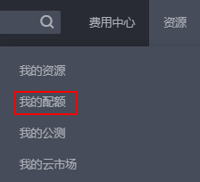

# 申请扩大云硬盘资源配额

## 操作场景

为防止资源滥用，平台限定了各服务资源的配额，对用户的资源数量和容量做了限制，如您可以创建的云硬盘数量、云硬盘容量以及快照数量。

若您当前的资源配额无法满足实际使用需求，您可以参考本章节操作申请扩大配额。

## 操作步骤

1.  登录管理控制台。
2.  在页面右上角，选择“资源 \> 我的配额”。

    系统进入“服务配额”页面。

    **图 1**  我的配额  
    

3.  单击“申请扩大配额”。
4.  在“新建工单”页面，根据您的需求，填写相关参数。

    其中，“问题描述”项请填写需要调整的内容和申请原因。

5.  填写完毕后，勾选协议并单击“提交”。

    单击“工单管理”，可以查看到您提交的申请详情。

