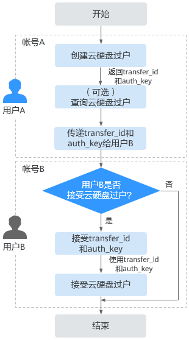

# 管理云硬盘过户

## 操作场景

通过云硬盘过户功能把一个帐号的云硬盘过户给另一个帐号，过户成功后，该云硬盘就属于接受过户的帐号。云硬盘过户当前只支持数据盘。

当前需要使用API接口来使用云硬盘过户功能，具体请参见[云硬盘过户](https://support.huaweicloud.com/api-evs/evs_04_2105.html)。

## 约束与限制

-   包周期的云硬盘不支持过户。
-   冻结的云硬盘不支持过户。
-   加密的云硬盘不支持过户。
-   云硬盘有对应的备份和快照时不支持过户。
-   云硬盘有备份策略时不支持过户。
-   DSS的云硬盘不支持过户。
-   DESS的云硬盘不支持过户。
-   EVS系统盘不支持过户。

## 操作步骤

以将帐号A的云硬盘过户给帐号B为例。用户A属于帐号A，用户B属于帐号B。由用户A创建过户记录，用户B通过云硬盘过户记录ID（transfer\_id）和云硬盘过户的身份认证密钥（auth\_key）接受过户，接受成功后即完成过户，基本流程如[图1](#fig86501415163119)所示。

> **说明：** 
>-   transfer\_id：云硬盘过户记录ID，每个云硬盘过户记录对应一个transfer\_id，用户B需要通过transfer\_id接受待过户的云硬盘。
>-   auth\_key：云硬盘过户的身份认证密钥，每个云硬盘过户记录对应一个auth\_key，用户B在接受云硬盘过户时需要使用auth\_key进行身份认证。

**图 1**  云硬盘过户操作流程  

1.  用户A创建云硬盘过户记录，具体请参见[创建云硬盘过户](https://support.huaweicloud.com/api-evs/evs_04_2106.html)。

    云硬盘过户记录创建成功后会返回transfer\_id和auth\_key。

2.  （可选）用户A可以查看云硬盘过户记录，具体请参见[查询单个云硬盘过户记录详情](https://support.huaweicloud.com/api-evs/evs_04_2109.html)。如果创建了多个云硬盘过户记录，还可以查询过户记录列表，具体请参见[查询云硬盘过户记录列表概要](https://support.huaweicloud.com/api-evs/evs_04_2110.html)或[查询云硬盘过户记录列表详情](https://support.huaweicloud.com/api-evs/evs_04_2111.html)。
3.  用户A将返回的transfer\_id和auth\_key传递给用户B。
4.  用户B是否接受云硬盘过户？
    -   是，请执行[5](#li61046537173317)。
    -   否，任务结束。

        对于未被接受的云硬盘过户，用户A可以进行删除，具体请参见[删除云硬盘过户](https://support.huaweicloud.com/api-evs/evs_04_2108.html)。

5.  用户B接受transfer\_id和auth\_key。
6.  用户B通过transfer\_id和auth\_key接受云硬盘过户，具体请参见[接受云硬盘过户](https://support.huaweicloud.com/api-evs/evs_04_2107.html)。

