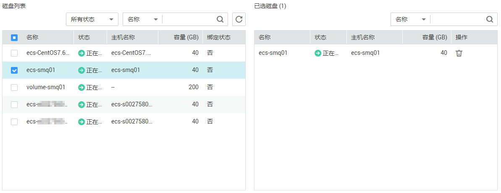

# 管理备份云硬盘

## 操作场景

备份云硬盘通过云备份服务提供的功能实现。

本章节指导用户为云硬盘设置备份策略。通过备份策略，就可以实现周期性备份云硬盘中的数据，从而提升数据的安全性。

> **说明：**   
>只有当云硬盘的状态为“可用“或者“正在使用“，则可以创建备份。  

## 购买云硬盘备份存储库并设置备份策略

1.  登录云备份管理控制台。
    1.  登录管理控制台。
    2.  单击管理控制台左上角的，选择区域和项目。
    3.  单击，选择“存储 \> 云备份 \> 云硬盘备份”。

2.  在界面右上角单击“购买云硬盘备份存储库“。
3.  选择计费模式。
    -   包年包月是预付费模式，按订单的购买周期计费，适用于可预估资源使用周期的场景，价格比按需计费模式更优惠。
    -   按需计费是后付费模式，根据实际使用量进行计费，可以随时购买或删除存储库。费用直接从账户余额中扣除。

4.  （可选）在磁盘列表中勾选需要备份的磁盘，勾选后将在已选磁盘列表区域展示，如[图1](#zh-cn_topic_0157095235_fig204531717131710)所示。

    **图 1**  选择磁盘  
    

    > **说明：**   
    >-   所选磁盘的状态必须为“可用”或“正在使用”。  
    >-   若不勾选磁盘，如需备份可在创建存储库后绑定磁盘即可。  

5.  输入存储库容量。此容量为绑定磁盘所需的总容量。存储库的空间不能小于备份磁盘的空间。取值范围为\[磁盘总容量，10485760\]GB。
6.  选择是否配置自动备份。
    -   立即配置：配置后会将存储库绑定到备份策略中，整个存储库绑定的磁盘都将按照备份策略进行自动备份。可以选择已存在的备份策略，也可以创建新的备份策略。
    -   暂不配置：存储库将不会进行自动备份。

7.  如开通了企业项目，需要为存储库添加已有的企业项目。

    企业项目是一种云资源管理方式，企业项目管理提供统一的云资源按项目管理，以及项目内的资源管理、成员管理，默认项目为default。

8.  （可选）为存储库添加标签。

    标签以键值对的形式表示，用于标识存储库，便于对存储库进行分类和搜索。此处的标签仅用于存储库的过滤和管理。一个存储库最多添加10个标签。

    标签的设置说明如[表1](#zh-cn_topic_0157095235_table191162312815)所示。

    **表 1**  标签说明

    
    <table><thead align="left"><tr id="zh-cn_topic_0157095235_row41151331884"><th class="cellrowborder" valign="top" width="9.900990099009901%" id="mcps1.2.4.1.1">
参数

    </th>
    <th class="cellrowborder" valign="top" width="71.28712871287128%" id="mcps1.2.4.1.2">
说明

    </th>
    <th class="cellrowborder" valign="top" width="18.81188118811881%" id="mcps1.2.4.1.3">
举例

    </th>
    </tr>
    </thead>
    <tbody><tr id="zh-cn_topic_0157095235_row51153313816"><td class="cellrowborder" valign="top" width="9.900990099009901%" headers="mcps1.2.4.1.1 ">
键

    </td>
    <td class="cellrowborder" valign="top" width="71.28712871287128%" headers="mcps1.2.4.1.2 ">
输入标签的键，同一个备份标签的键不能重复。键可以自定义，也可以选择预先在标签服务（TMS）创建好的标签的键。

    
键命名规则如下：

    <ul id="zh-cn_topic_0157095235_ul20115438812"><li>长度范围为1到36个Unicode字符。</li><li>不能为空，不能包含非打印字体ASCII（0-31），以及特殊字符“=”，“*”，“&lt;”，“&gt;”，“\”，“,”，“|”，“/”且首尾字符不能为空格。</li></ul>
    </td>
    <td class="cellrowborder" valign="top" width="18.81188118811881%" headers="mcps1.2.4.1.3 ">
Key_0001

    </td>
    </tr>
    <tr id="zh-cn_topic_0157095235_row21161531187"><td class="cellrowborder" valign="top" width="9.900990099009901%" headers="mcps1.2.4.1.1 ">
值

    </td>
    <td class="cellrowborder" valign="top" width="71.28712871287128%" headers="mcps1.2.4.1.2 ">
输入标签的值，标签的值可以重复，并且可以为空。

    
标签值的命名规则如下：

    <ul id="zh-cn_topic_0157095235_ul211610318811"><li>长度范围为0到43个Unicode字符。</li><li>可以为空字符串，不能包含非打印字体ASCII（0-31），以及特殊字符“=”，“*”，“&lt;”，“&gt;”，“\”，“,”，“|”，“/”且首尾字符不能为空格。</li></ul>
    </td>
    <td class="cellrowborder" valign="top" width="18.81188118811881%" headers="mcps1.2.4.1.3 ">
Value_0001

    </td>
    </tr>
    </tbody>
    </table>

9.  输入待创建的存储库的名称。

    只能由中文字符、英文字母、数字、下划线、中划线组成，且长度小于等于64个字符。例如：vault-612c。

    > **说明：**   
    >也可以采用默认的名称，默认的命名规则为“vault\_xxxx”。  

10. 当计费模式为“包年/包月”时，需要选择购买时长。可选取的时间范围为1个月\~3年。

    可以选择是否自动续费，勾选自动续费时：

    -   按月购买：自动续费周期为1个月。
    -   按年购买：自动续费周期为1年。

11. 单击“立即购买”。确认存储库购买详情，单击“去支付”。
12. 根据页面提示，完成支付。
13. 返回云硬盘备份页面。可以在存储库列表看到成功创建的存储库。

    可以为新的存储库绑定磁盘、为磁盘创建备份等操作，请参见[存储库管理](https://support.huaweicloud.com/usermanual-cbr/cbr_03_0002.html)章节。

